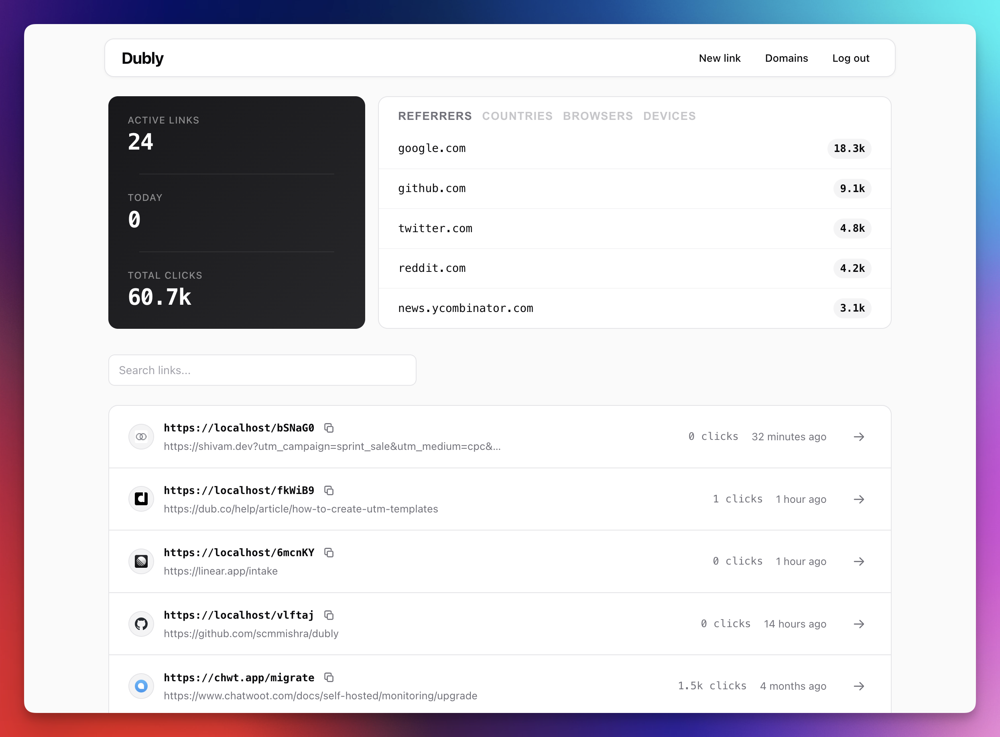
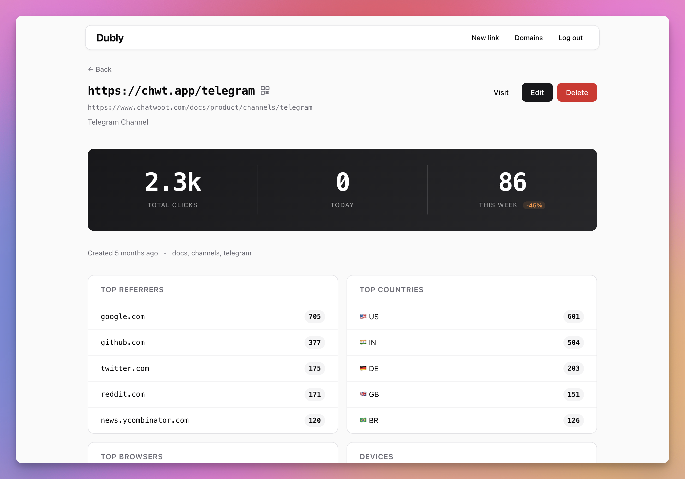

# Dubly

A simple, single-user URL shortener. Built with Go and SQLite. Comes with an admin UI, click analytics, and support for multiple custom domains.

<p>
  
</p>

<details>
  <summary>More screenshots</summary>
  <br>
  
</details>

## Install

Run the install script on a fresh Ubuntu/Debian server. It handles everything — Go, Caddy for HTTPS, systemd, firewall, and optional S3 backups.

```bash
curl -fsSL https://raw.githubusercontent.com/scmmishra/dubly/main/scripts/install.sh | sudo bash
```

Or clone and run:

```bash
git clone https://github.com/scmmishra/dubly.git
cd dubly
sudo bash scripts/install.sh
```

The script asks for your domain(s), API password, and optional S3/GeoIP settings.

To update later:

```bash
sudo /opt/dubly/scripts/install.sh --update
```

To add a new domain to an existing installation:

```bash
sudo bash /opt/dubly/scripts/add-domain.sh newdomain.com
```

This updates the `.env` and Caddyfile, then restarts both services. You still need to point a DNS A record to your server.

## Local Development

```bash
go build -o dubly ./cmd/server

DUBLY_PASSWORD=your-secret-key \
DUBLY_DOMAINS=short.io,go.example.com \
./dubly
```

## Configuration

Everything is configured through environment variables.

| Variable | Required | Default | Description |
|----------|----------|---------|-------------|
| `DUBLY_PASSWORD` | Yes | — | API password |
| `DUBLY_DOMAINS` | Yes | — | Allowed domains, comma-separated |
| `DUBLY_PORT` | No | `8080` | Server port |
| `DUBLY_DB_PATH` | No | `./dubly.db` | SQLite database path |
| `DUBLY_APP_NAME` | No | `Dubly` | Name shown in the admin UI |
| `DUBLY_GEOIP_PATH` | No | — | Path to GeoLite2-City.mmdb for geo lookup |
| `DUBLY_FLUSH_INTERVAL` | No | `30s` | How often analytics are saved to disk |
| `DUBLY_BUFFER_SIZE` | No | `50000` | Analytics buffer size |
| `DUBLY_CACHE_SIZE` | No | `10000` | Max cached redirects |

## API

All `/api/*` routes require the `X-API-Key` header.

### Create a link

```bash
curl -X POST http://localhost:8080/api/links \
  -H "X-API-Key: your-secret-key" \
  -H "Content-Type: application/json" \
  -d '{
    "domain": "short.io",
    "destination": "https://example.com/some/long/url",
    "title": "Example Link",
    "tags": "demo",
    "slug": "custom-slug"
  }'
```

`slug` is optional — a random 6-character slug is generated if omitted.

### List links

```bash
curl "http://localhost:8080/api/links?limit=25&offset=0&search=example" \
  -H "X-API-Key: your-secret-key"
```

### Get a link

```bash
curl http://localhost:8080/api/links/1 \
  -H "X-API-Key: your-secret-key"
```

### Update a link

```bash
curl -X PATCH http://localhost:8080/api/links/1 \
  -H "X-API-Key: your-secret-key" \
  -H "Content-Type: application/json" \
  -d '{"destination": "https://example.com/new-url"}'
```

### Delete a link

```bash
curl -X DELETE http://localhost:8080/api/links/1 \
  -H "X-API-Key: your-secret-key"
```

Deleted links return `410 Gone` on redirect.

## Redirects

Requests that don't match `/api/` or `/admin/` are treated as redirects. The domain comes from the `Host` header, the slug from the path.

```
https://short.io/custom-slug → 302 → https://example.com/some/long/url
```

## Analytics

Clicks are buffered in memory and saved to SQLite in batches. Each click records:

- Timestamp, IP, referer
- Browser, OS, device type
- Country, city, region, coordinates (requires [GeoLite2](https://www.maxmind.com/en/geolite2/signup))

### Bot & Non-Human Traffic Filtering

Dubly automatically filters out non-human traffic so analytics only count real clicks. Bots still get redirected — they just aren't recorded.

**User-Agent detection** — Requests are checked against known bot signatures: link-preview fetchers (iMessage, Discord, Slack, WhatsApp, Facebook, Twitter, LinkedIn, Telegram), search engine crawlers, HTTP client libraries (curl, wget, python-requests, etc.), headless browsers, and security scanners.

**IP-based filtering** — On startup, Dubly fetches known datacenter and threat IP ranges and refreshes them every 24 hours. Clicks from these IPs are dropped.
